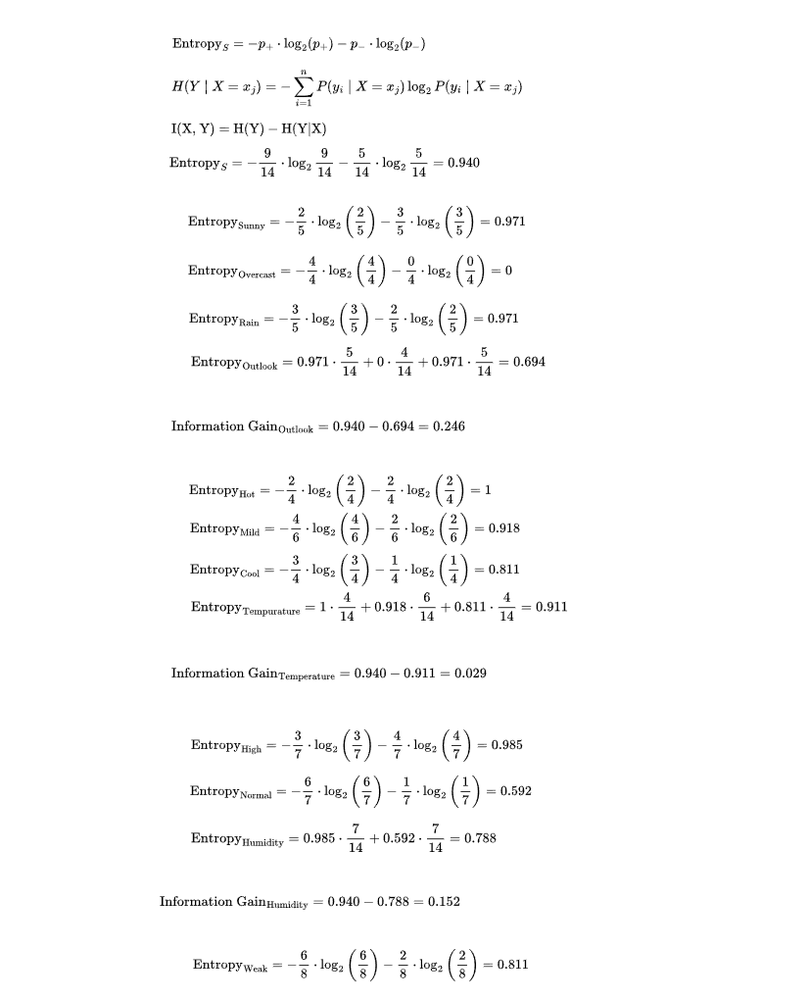
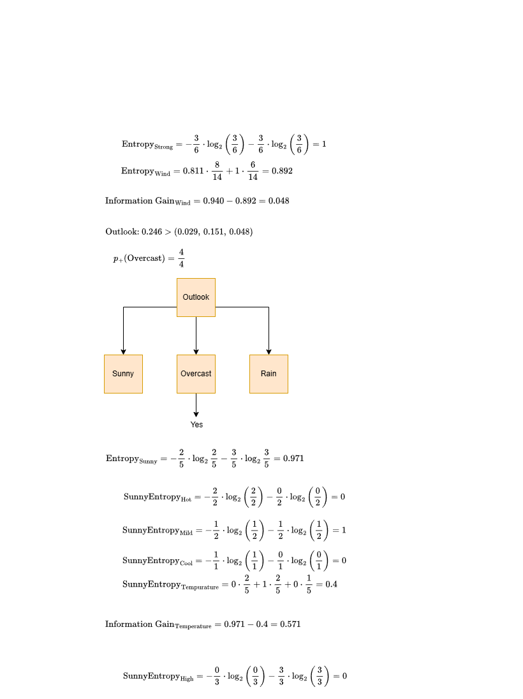
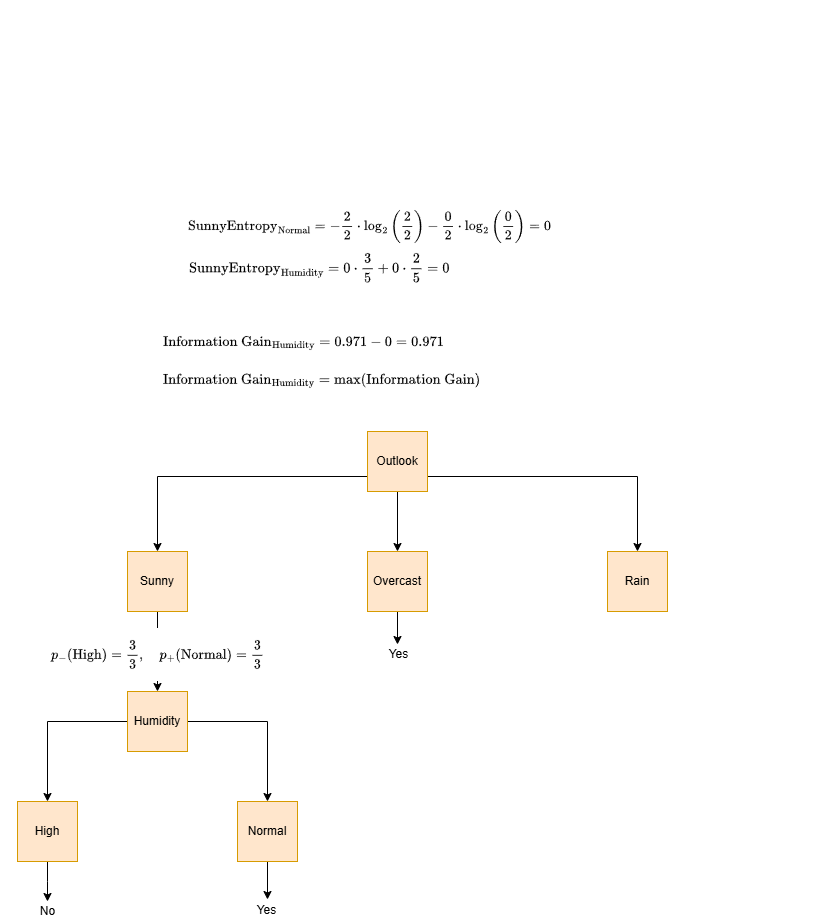
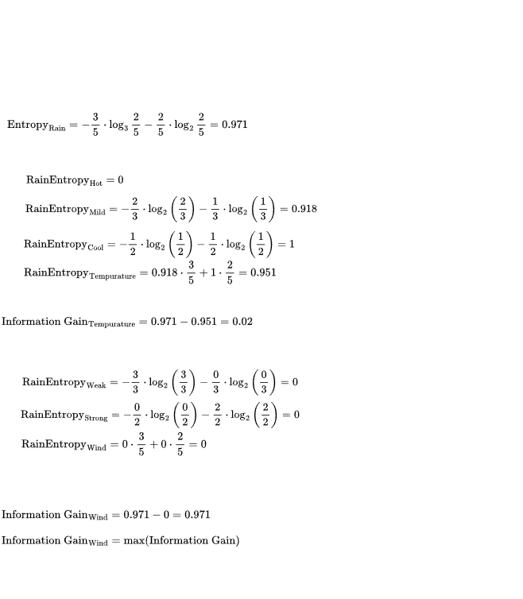
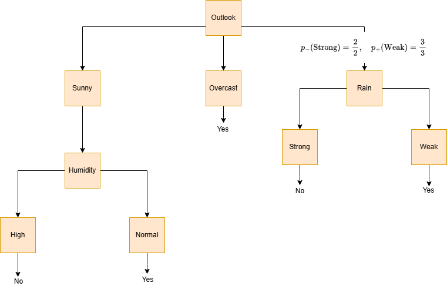

```{r setup, include = FALSE}

knitr::opts_chunk$set(echo = FALSE)

options(scipen = 999)

```

\begin{center}
\LARGE \textbf{Computer Science Assignment Question Two} \\
\end{center}

\begin{center}
\Large \textbf{Michael Alizzi} \\
\Large \textbf{15 April 2025}
\end{center}

\rule{\textwidth}{0.4pt}

### a) Manually construct a Decision Tree for the following set of examples. What class is assigned to the instance of D15: {Sunny, Hot, High, Weak}?

```{r ID3 Tree 1, out.width="\\textwidth", out.height="\\textheight", fig.align="center", echo=FALSE}



```

```{r ID3 Tree 2, out.width="\\textwidth", out.height="\\textheight", fig.align="center", echo=FALSE}



```

```{r ID3 Tree 3, out.width="\\textwidth", out.height="\\textheight", fig.align="center", echo=FALSE}



```

```{r ID3 Tree 4, out.width="\\textwidth", out.height="\\textheight", fig.align="center", echo=FALSE}



```

```{r ID3 Tree 5, out.width="\\textwidth", out.height="\\textheight", fig.align="center", echo=FALSE}



```

Following the tree, D15 would be classified as no (or not playing tennis).

### b) Consider a Naive Bayes classifier for the same set of examples. What class is assigned to the instance of D15: {Sunny, Hot, High, Weak}?

$$
\text{P(Play | Outlook, Temperature, Humidity, Wind)} =
$$

$$
\frac{\text{P(Outlook, Temperature, Humidity, Wind | Play)} \cdot \text{P(Play)}}{\text{P(Outlook, Temperature, Humidity, Wind)}}
$$

$\text{P(Outlook, Temperature, Humidity, Wind |} \text{Play}_\text{Yes}) \cdot P(\text{Play}_\text{Yes}) =$

$P(\text{Sunny} \mid \text{Play}_{\text{Yes}}) \cdot P(\text{Hot} \mid \text{Play}_{\text{Yes}}) \cdot P(\text{High} \mid \text{Play}_{\text{Yes}}) \cdot P(\text{Weak} \mid \text{Play}_{\text{Yes}}) \cdot P(\text{Play}_{\text{Yes}}) =$

```{r Bayes Yes}

num_y <- round((2/9)*(2/9)*(3/9)*(6/9)*(9/14), 3)

```

$\frac{2}{9} \cdot \frac{2}{9} \cdot \frac{3}{9} \cdot \frac{6}{9} \cdot \frac{9}{14} = `r num_y`$

$\text{P(Outlook, Temperature, Humidity, Wind |} \text{Play}_\text{No}) \cdot P(\text{Play}_\text{No}) =$

$P(\text{Sunny} \mid \text{Play}_{\text{No}}) \cdot P(\text{Hot} \mid \text{Play}_{\text{No}}) \cdot P(\text{High} \mid \text{Play}_{\text{No}}) \cdot P(\text{Weak} \mid \text{Play}_{\text{No}}) \cdot P(\text{Play}_{\text{No}}) =$

```{r Bayes No}

num_n <- round((3/5)*(2/5)*(4/5)*(2/5)*(5/14), 3)

```

$\frac{3}{5} \cdot \frac{2}{5} \cdot \frac{4}{5} \cdot \frac{2}{5} \cdot \frac{5}{14} = `r num_n`$

$\text{P(Outlook, Temperature, Humidity, Wind) = constant}$

$\text{Therefore:}$

$`r num_n` \text{>} `r num_y`$ 

The class assigned for D15 is no (or not playing tennis).
